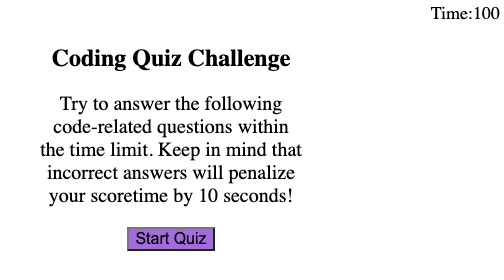

# code-quiz

## Description
I generate the webpage with countdown timer, and the user need to answer a series of questions which will be graded.
The main purpose of this webpage is to compare progress between peers.

## Tech used
- HTML
- CSS
- JavaScript
- GitHub
- Terminal
- Visual Studio Code

## Use
Step 1: user click on the start button to start the timer.
Step 2: user choose the answer of each question and the webpage will tell if the answer is correct or not.
Step 3: the webpage will show the sum of total scores and ask you to submit your name.

## Learning point
In the JavaScript,
I learn how to set up timer. 
I learn how to set up questions and let user know if they are right or wrong.
I learn how to set up grading of the result at the end of the webpage, therefore the user can insert their name to store the score. 

## Link
https://yingyliu.github.io/code-quiz/

## License
Please refer to the LICENSE in the repo.